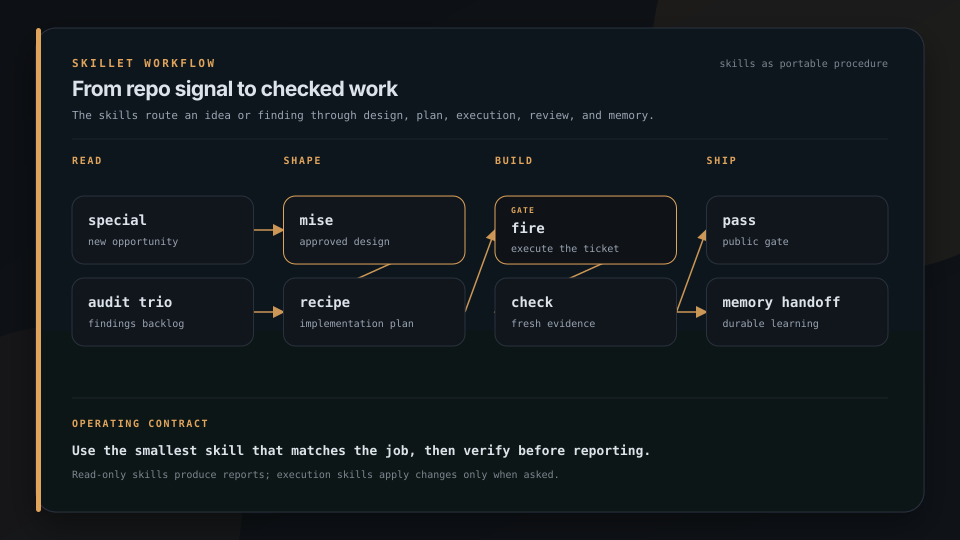

<p align="center">
  
</p>

<h1 align="center">skillet</h1>

<p align="center">
  
</p>

<p align="center">
  <strong>A skillet full of agent skills that actually ship work.</strong>
</p>

<p align="center">
  Production-tested SKILL.md workflows for audits, bug hunts, security sweeps, publish gates, releases, and memory handoffs. Auto-trigger across Claude Code, Codex, and compatible harnesses.
</p>

<p align="center">
  <a href="https://brigade.tools/skillet">Website</a> &middot; <a href="#install">Install</a> &middot; <a href="#the-skills">The skills</a> &middot; <a href="https://brigade.tools">Brigade hub</a>
</p>

<p align="center">
  
  
  
</p>

## Install

```bash
# Claude Code plugin marketplace
/plugin marketplace add escoffier-labs/skillet

# or via Brigade skills station
brigade add skills
```

## What it does

| | Job | What you get |
|---|---|---|
| **Audit** | See what matters first | line-check, bug-hunt, security-sweep, latent-premises, retry-safety with priority-sorted backlogs |
| **Ship** | Gate what goes public | publish-readiness, garnish, release-cut, plate |
| **Execute** | Plan, build, upgrade, and measure | recipe, taste, stocktake, thermometer, reduce |
| **Remember** | File what you learned | memory-handoff compatible with Brigade |


## Try it in 60 seconds

```bash
# Any `npx skills`-compatible harness
npx skills add escoffier-labs/skillet --list   # see every skill without installing
npx skills add escoffier-labs/skillet          # install the roster
```

Then ask your agent naturally, or invoke a skill directly:

```
/line-check        # seven-station repo audit, priority-sorted backlog
/security-sweep    # defensive security audit, each finding with a prescribed fix
/publish-readiness # leak scan before a repo goes public
```

Full install paths (Claude Code marketplace, raw `SKILL.md` copy, per-repo) are under [Install](#install).

## The skills

### The audit roster

Five skills, one report contract ([docs/audit-report-format.md](docs/audit-report-format.md)). Run any of them alone, or all five over time. The findings compose into a single priority-sorted backlog.

| Skill | What it does |
|-------|--------------|
| **line-check** | The flagship. A chef's line check for your repo: walks seven stations (docs, agent-readiness, tests/CI, hygiene, structure, release hygiene, TODO mining), scores each, and delivers a backlog sorted by impact relative to effort. Brigade-aware: if the repo uses [brigade](https://github.com/escoffier-labs/brigade), its handoff and memory health get audited too. |
| **bug-hunt** | Correctness sweep across five lenses with mandatory adversarial verification. Only bugs that survive a refutation attempt make the report, each with a concrete trigger. |
| **security-sweep** | Defensive security audit: secrets (tree and history), dependency CVEs, injection surfaces, authn/authz, exposure. Every finding ships with its remediation. |
| **latent-premises** | Hunts the assumptions code takes for granted that nothing enforces: input shape, callee contracts, environment, ordering, cardinality. A finding needs a nameable break and ends with one resolution arrow (guard it, document it, or encode it in the type). The forward-looking counterpart to bug-hunt. |
| **retry-safety** | Checks whether a diff's side effects survive a second run: database writes, migrations, network mutations, payments, queue consumers. The standard is idempotent read-modify-write at the side-effecting edge, and migrations also get the deploy-window lens (expand-migrate-contract). |

The audit roster is read-only by design. **expedite** is the step that closes the loop:

| Skill | What it does |
|-------|--------------|
| **expedite** | Takes an audit backlog and drives it to done: highest-priority finding first, one focused change at a time, each one verified before the next, parking anything destructive or breaking for you to decide. The execution partner to the audit roster. |

### The line

Portable process skills for planning, building, debugging, reviewing, maintaining, and finishing code changes.



Generated from [`docs/assets/workflows/daily-workflow.json`](docs/assets/workflows/daily-workflow.json) with `plating workflow`.

| Skill | What it does |
|-------|--------------|
| **special** | The chef's special: walks the repo for what is possible rather than what is broken, and proposes net-new features grounded in evidence already in the code (unfinished work, asymmetries, adjacent capability, friction, ecosystem fit). Read-only, priority-sorted, every proposal tied to a signal in the walk-in and cut if it is ungrounded or fights a stated non-goal. The opportunity-finding counterpart to the audit roster. A chosen special feeds mise. |
| **mise** | Mise en place for building: turns an idea into a design the user approved and a written spec, before any code. Reads the context, proposes 2-3 approaches with a recommendation, presents the design scaled to its complexity, and hands off to recipe. Composes with pressure-test for hardening the load-bearing decisions; [miseledger](https://github.com/escoffier-labs/miseledger) keeps the receipts. |
| **recipe** | Turns an approved spec into an implementation plan a zero-context engineer or fresh session can execute without you: a file map, bite-size test-first steps with the actual code, exact commands with expected output, and every decision pinned. The card the line cooks work from. |
| **fire** | Executes a written plan task by task, the way the line cooks a fired ticket: isolated branch, critical read of the plan against the code first, checkboxes ticked as the live worklist, structural divergences stopped and sent back instead of improvised, and a proper finish (merge, PR, keep, or discard). |
| **worktree** | A clean station before service: sets up an isolated workspace for risky or parallel work, preferring the harness's native worktree tool and falling back to a git worktree. Detects existing isolation first so it never stacks a worktree on a worktree. Pairs with stations and fire. |
| **stagiaire** | A cook visiting from another kitchen: dispatches one-shot workers on other vendors' CLIs (cursor-agent, grok, codex, claude, agy, ollama, opencode, pi) over the user's own logins, with the exact headless flags and the silent-failure trap for each. One model call per dispatch, no API keys. Points at brigade's roster when dispatches become routine. |
| **taste** | Test-first discipline that survives pressure: the failing test is written and watched failing before any implementation, especially when production is down and the instruction is "just make it work". Nothing leaves the kitchen untasted. |
| **demi** | Pre-build simplicity gate: starts with the smallest useful implementation that satisfies the request, fits the repo, and can be verified. Climbs the ladder before custom code (existing behavior, repo primitives, standard library, platform features, installed dependencies, then one local change), cuts speculative scaffolding, names the growth trigger that would justify more, and refuses to treat YAGNI as skimping on validation, security, accessibility, data-loss handling, compatibility shims, or checks. |
| **reduce** | Behavior-preserving simplification: boils the excess off code you just changed and concentrates the intent without altering what it does. Establishes a behavior lock (tests green before and after) before touching anything, refuses load-bearing redundancy and premature abstraction, applies one category per commit, and hands correctness or design issues to bug-hunt, security-sweep, or line-check. Applies by default, drops to a report when behavior cannot be locked. |
| **refire** | Root-cause-first debugging: when something misbehaves, find out why the plate came back before cooking it again. Reproduce, check what changed, check the contract, trace to the source, pin the bug with a failing test, then one minimal fix. Three failed fixes means question the architecture. |
| **stocktake** | Dependency and toolchain maintenance: inventories manifests, lockfiles, runtime pins, CI pins, and the resolved graph before changing one compatibility boundary. Reads maintainer release and migration notes, reviews transitive deltas, and verifies the final resolved versions. |
| **thermometer** | Measured performance work: pins a workload and metric, collects multiple baseline samples, profiles the bottleneck, changes one hypothesis, and compares the same samples again without trading away correctness. |
| **review** | The second palate: dispatches a fresh reviewer with crafted context (the diff and the requirements, never your session history) to catch what you have gone nose-blind to. The independent pass that pass calls for; hands its findings to sendback. |
| **sendback** | Receiving review feedback with rigor instead of reflex: verify each claim against the codebase, YAGNI-gate the "should also support" items, stop on vague items instead of guessing, push back with evidence, and skip the performative "great point!" entirely. |
| **check** | The expeditor's look at every plate before it leaves: no claim of done, fixed, or passing without fresh verification evidence in the same reply. Subagent success reports are claims to verify, not evidence to relay, and a failing verification is a finding to report, never an invitation to make the command pass. |
| **stations** | The expeditor's fan-out for parallel agents: cluster failures by root cause before dispatching (a symptom list is not a work breakdown), check write sets for collisions, give each station a complete self-contained ticket, and taste the integrated result yourself. |
| **pressure-test** | Drives a plan or design to explicit decisions before anyone builds, one decision at a time, each pinned to its basis. Includes sous mode: going AFK? The agent makes the reversible calls in your place, tags each answer evidence/constraint/judgment, parks anything it can't take back, and leaves you an auditable transcript. |
| **pass** | The gate before a pull request leaves your hands: real-fix-not-bandaid, tested and green, one concern, self-reviewed diff, clean artifact, and a PR body the author approves before anything is filed. The chef's inspection at the pass. |
| **release-cut** | Changelog roll-up, semver bump, tag, GitHub release, drafted announcement. Releases on request, never per feature. |
| **memory-handoff** | Ends a session by writing durable knowledge into a structured handoff a memory owner can review and file. Pairs with brigade, works standalone. |
| **skillify** | The meta-skill: turn a script, runbook, or repeated workflow into a new skill, with a fresh-agent test before you call it done. |
| **t3-code** | Sets up and troubleshoots T3 Code across Linux and Windows machines: project state, saved environments, headless services, Windows Scheduled Tasks, direct Tailnet access, Tailscale Serve, local SSH tunnels, updates, launchers, and icons. |
| **using-skillet** | The line check before service: the bootstrap that maps every skillet skill to its job and requires invoking the relevant one before any response. Injected at session start (via the plugin's SessionStart hook) so skills auto-trigger from the catalog routes. |

### Plating

Publication gates for prose, video, site metadata, and whole repositories.

| Skill | What it does |
|-------|--------------|
| **plate** | The last look before prose goes public: scrubs a blog post, social draft, PR body, or commit message for internal hostnames, private IPs, leaked paths, and AI-authorship disclosures, applies writing conventions, and previews every change before editing the author's voice. |
| **grill** | Hardens a technical post for Hacker News, Lobsters, or another skeptical audience. Checks claims, sources, numbers, title framing, and the objections likely to appear in comments, then hands the draft to plate. |
| **reel-check** | Checks rendered reels, screen recordings, and demo videos for identity or infrastructure leaks in both source text and sampled frames, then verifies the new render. |
| **garnish** | Audits or fixes portable website metadata: titles, descriptions, canonical URLs, robots policy, Open Graph, structured data, sitemaps, and rendered output. Project-local policy supplies domains and account values. |
| **publish-readiness** | The gate before a repository goes public: working-tree and git-history leak scans, hygiene checks, and the history-rewrite recipe for content that already leaked. |

### Appliances

These skills operate optional tools. They remain top-level skill packages, but their procedures only apply when the named tool is installed and configured.

| Skill | What it does |
|-------|--------------|
| **graphtrail** | Answers structural code questions from a GraphTrail index: callers, callees, impact, file neighbors, context, and before/after graph changes. Falls back to text or syntax tools when the question is not graph-shaped. |
| **brigade-handoffs** | Sets up and checks [brigade](https://github.com/escoffier-labs/brigade) handoff inboxes for repos and agent workspaces, writes linted local drafts, reviews the pending queue, and keeps canonical memory changes review-gated. |

## Usage

Ask naturally ("audit this repo", "is this safe to publish", "cut a release") or invoke directly:

```
/line-check
/security-sweep
/brigade-handoffs
/pressure-test   (add "answer your own questions, I'm going afk" for sous mode)
```

line-check, bug-hunt, security-sweep, latent-premises, and retry-safety are read-only by design. They produce reports and backlogs. **expedite** is the separate, opt-in step that applies the fixes, parking anything destructive or breaking for you to decide.

## Why not something else?

- **A single mega-prompt or one big `CLAUDE.md`** works until it bloats past the context budget and goes stale, and it loads every instruction on every turn whether the work matches or not. skillet is one self-contained file per job that triggers only when the work matches, so the audit procedure does not cost context while you are cutting a release.
- **Hand-rolling the procedure each session** means the gotcha you learned last month (the repo that published with hostnames in its history, the audit that produced a wall of unprioritized findings) is gone by the next session. Each skill encodes the procedure plus the hard-won gotchas so the floor stays raised.
- **A tool-locked agent framework** ties the workflow to one harness. skillet skills are plain `SKILL.md` files: they install into Claude Code, Codex, or any `SKILL.md`-compatible harness, per-machine or per-repo, the same way.
- **Native harness skill libraries** are great, and skillet is not a replacement for the harness. It is the roster of process skills you drop on top, with a shared report contract so the read-only auditors and the execution skills compose instead of each inventing its own format.

## What skillet is not

skillet is not an agent, a runtime, or a service. It does not:

- run anything on its own or install a daemon, scheduler, or background process
- ship a CLI or a binary; the skills are markdown the harness reads
- carry a runtime dependency or call out to the network on its own
- replace your harness, your model, or your editor
- apply changes from the read-only audit skills (line-check, bug-hunt, security-sweep, latent-premises, retry-safety, special). Applying findings is the separate, opt-in **expedite** step
- cut releases automatically; **release-cut** runs on request, never per feature

The skills carry the procedure and the discipline. You stay in the loop for anything destructive, breaking, or public.

## Why these exist

Every skill here is extracted from a real workflow that broke or burned time the manual way: repos published with internal hostnames in the history, audits that produced walls of findings nobody prioritized, releases with mismatched versions, sessions whose hard-won knowledge died in the transcript. The skills encode the procedure plus the gotchas.

## Contributing

Bug reports, sharper skill triggers, and new skills are welcome. See [CONTRIBUTING.md](CONTRIBUTING.md) for the support scope and contribution path, [SECURITY.md](SECURITY.md) for reporting a vulnerability, and the [Code of Conduct](CODE_OF_CONDUCT.md).

## License

MIT. See [LICENSE](LICENSE).
